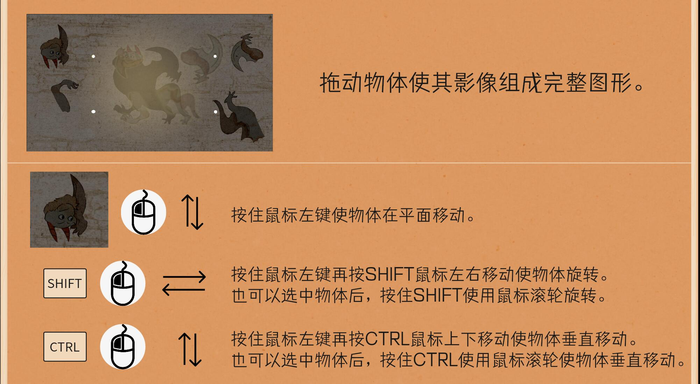
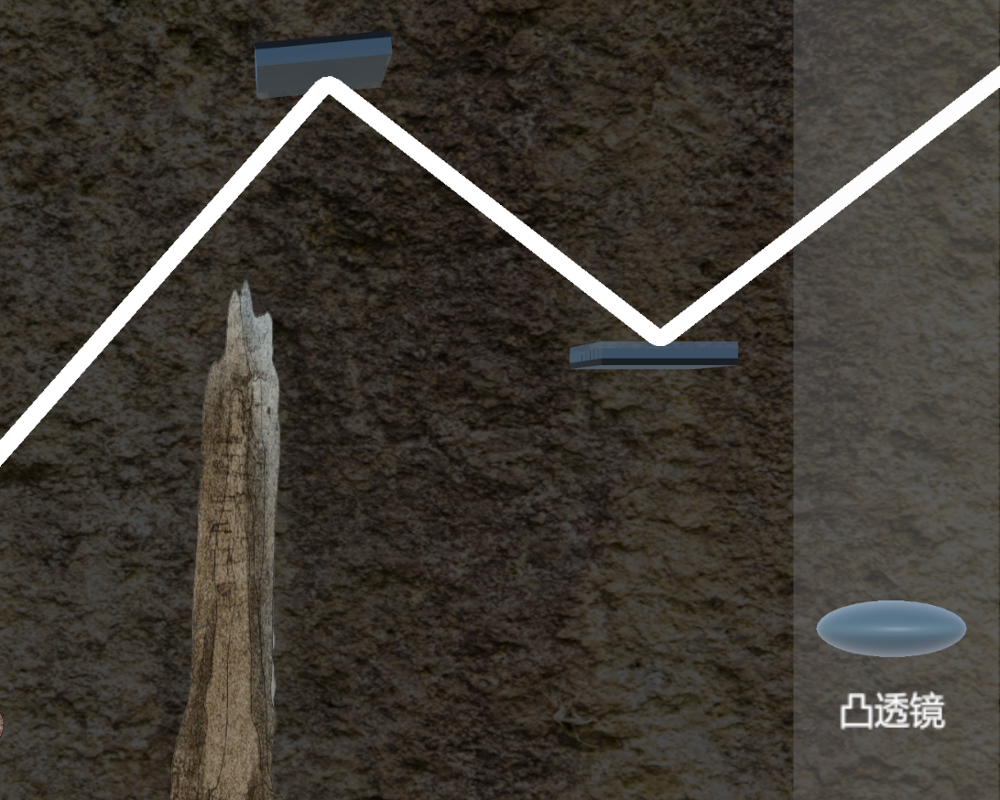
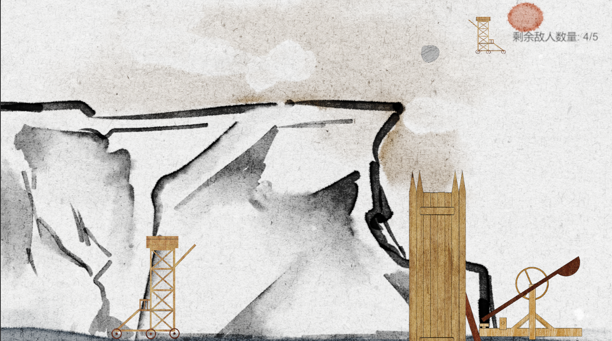

# jiandan-xiaqiu.github.io
# 曾鑫 - 技术作品集

> Unity 客户端 | 游戏程序员 | 

🔗 **在线作品集**

## 🎮 Unity 项目展示

### [泡泡大战]
实现 玩家角色移动、攻击、技能释放等 核心控制逻辑。
设计并开发 多种道具和技能效果（如回血、子弹、旋风）
利用 Rigidbody 物理特性 实现碰撞与运动效果，优化性能 避免物理计算开销过大。
搭建 关卡编辑器基础框架 与 事件系统，采用观察者模式 降低系统模块间耦合度。
实施对象池技术 管理游戏对象（子弹、特效），显著减少运行时内存分配与 GC 开销，提升游戏流畅度。

### [墨影寻光](https://github.com/cancellated/MOZI)

**项目概述**：基于Unity引擎开发的3D解谜游戏，融合物理交互、光学模拟和回合制战斗等多种玩法，包含3个不同类型的关卡。

**核心架构**：
- **泛型单例系统**：实现线程安全的SingletonBase<T>基类，支持延迟初始化和DontDestroyOnLoad，为所有管理器提供统一的全局访问点
- **事件驱动架构**：使用C# Action构建静态事件总线系统，实现关卡、故事、CG、场景切换等模块间的解耦通信
- **场景流程管理**：设计完整的关卡解锁/完成逻辑，支持关卡→故事→CG→关卡选择的流程控制，JSON存档系统实现本地数据持久化

**关卡实现**：
- **Level 1 - 物体拼图**：实现3D物体拖拽、旋转、深度调整的交互系统，使用协程实现镜头推进、材质渐变、物体消失的并行动画效果

- **Level 2 - 光学反射**：使用LineRenderer结合Physics.Raycast技术实现光线的发射、反射与折射核心玩法，支持镜面反射和凸透镜折射，最大反射次数限制优化性能

- **Level 3 - 回合制战斗**：设计敌波次系统和回合制AI逻辑，实现玩家投石机控制与敌人AI行为的回合制战斗机制

**技术亮点**：
- **光学物理模拟**：使用LineRenderer绘制光线路径，Physics.Raycast实现光线追踪，Vector3.Reflect计算镜面反射，自定义算法实现透镜折射
- **数据驱动设计**：通过读取CSV配置文件实现动态数据加载，Resources系统管理配置资源，UTF-8 BOM处理确保跨平台兼容性
- **性能优化实践**：对象池技术管理游戏对象，异步场景加载避免阻塞，及时释放未使用资源，减少GC压力
- **UI系统**：动态UI组件设计，CSV配置驱动，Animator控制UI过渡动画，实时更新关卡状态
- **音频管理**：双AudioSource设计（背景音乐+音效），支持循环/非循环播放，动态切换音乐
- **CG播放系统**：VideoPlayer组件集成，CG ID到VideoClip映射，CanvasGroup淡入效果，支持跳过功能

**设计模式应用**：
- 单例模式（泛型单例基类）
- 观察者模式（静态事件系统）
- 策略模式（不同关卡Manager实现不同玩法）
- 工厂模式（动态创建敌人/物体）

## 💼 专业技能
- **编程**: C# (Unity)
- **引擎**: Unity
- **工具**: Git, SourceTree

## 📫 联系方式
- 邮箱：202219121230@stu.cdut.edu.cn

