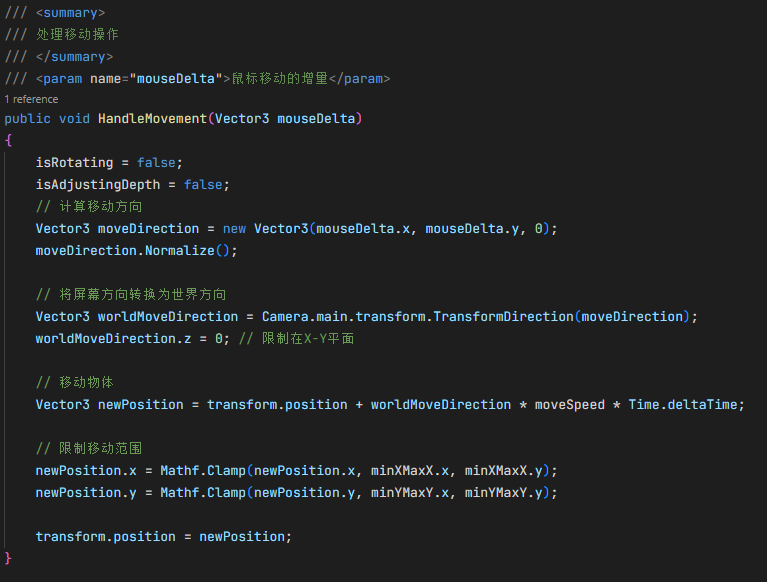
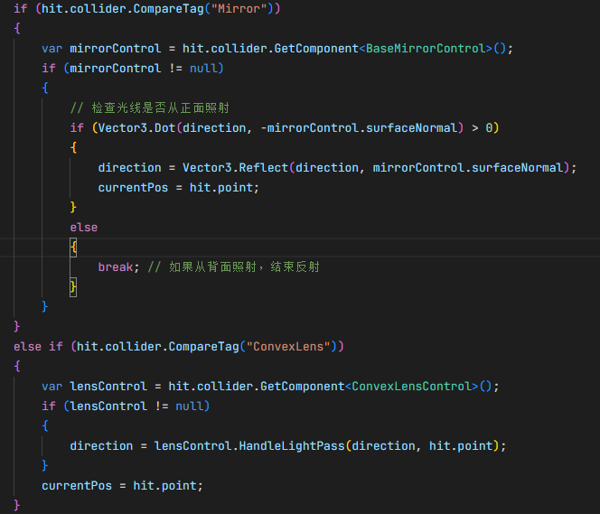
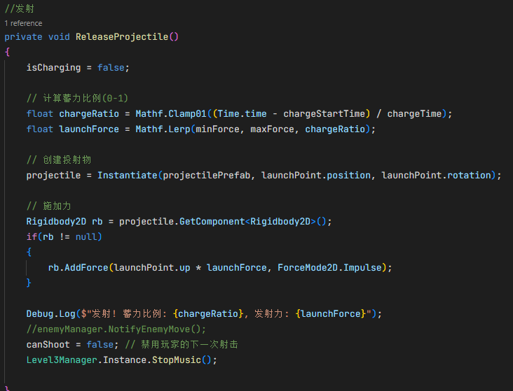
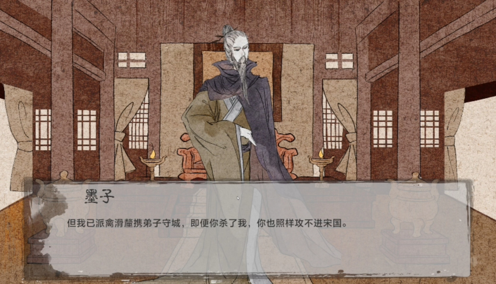
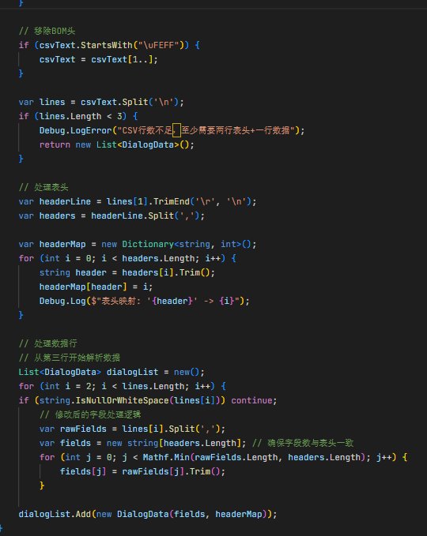
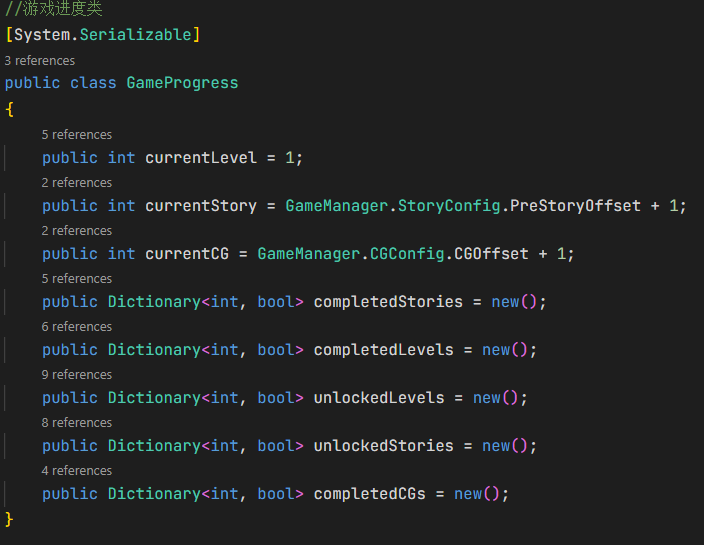

# jiandan-xiaqiu.github.io
# 曾鑫 - 技术作品集

> Unity 客户端 | 游戏程序员 | 

简历

🔗 **在线作品集**

## 🎮 Unity 项目展示

### [泡泡大战]
实现 玩家角色移动、攻击、技能释放等 核心控制逻辑。
设计并开发 多种道具和技能效果（如回血、子弹、旋风）
利用 Rigidbody 物理特性 实现碰撞与运动效果，优化性能 避免物理计算开销过大。
搭建 关卡编辑器基础框架 与 事件系统，采用观察者模式 降低系统模块间耦合度。
实施对象池技术 管理游戏对象（子弹、特效），显著减少运行时内存分配与 GC 开销，提升游戏流畅度。

### [墨影寻光](https://github.com/cancellated/MOZI)

**项目概述**：基于Unity引擎开发的3D解谜游戏，融合物理交互、光学模拟和回合制战斗等多种玩法，包含3个不同类型的关卡。

**核心架构**：
- **泛型单例系统**：实现线程安全的SingletonBase<T>基类，支持延迟初始化和DontDestroyOnLoad，为所有管理器提供统一的全局访问点
- **事件驱动架构**：使用C# Action构建静态事件总线系统，实现关卡、故事、CG、场景切换等模块间的解耦通信
- **场景流程管理**：设计完整的关卡解锁/完成逻辑，支持关卡→故事→CG→关卡选择的流程控制，JSON存档系统实现本地数据持久化

**关卡实现**：
- **Level 1 - 物体拼图**：

第一关构建了基于物理射线检测的3D交互系统，通过Physics.Raycast与ScreenPointToRay实现屏幕坐标到世界坐标的精确映射，支持物体拖拽移动、旋转及深度调整三种变换模式，并利用鼠标滚轮与Mathf.Clamp实现物体与相机距离的动态控制。系统设计了对称物体自动同步机制，确保拼图对称性，同时通过Dictionary实时管理物体状态，在物体到达目标位置时触发材质渐变动画。

如图为第一关的交互系统的物体拖拽移动实现逻辑。

通关流程采用协程并行动画系统，通过RunParallelCoroutine包装器实现镜头推进、图片渐显、阴影渐亮三个动画的并行执行与完成计数，利用Color.Lerp实现材质颜色与透明度的平滑过渡，FadeInCoroutine与FadeToAlphaCoroutine分别处理物体达标与通关时的视觉效果。系统集成了音频自动切换机制，通过AudioManager统一管理背景音乐与通关音乐的播放，并在OnDestroy生命周期方法中停止所有协程，确保资源的正确释放与内存管理。

- **Level 2 - 光学反射**：

第二关构建了基于物理射线追踪的光学模拟系统，通过LineRenderer实时绘制光线路径，利用Physics.Raycast逐帧检测光线与场景物体的碰撞，实现光线的发射、反射与折射计算。系统采用Vector3.Reflect计算镜面反射方向，设计凸透镜折射算法，根据入射方向自动调整法线向量，确保透镜两面透光一致性，并通过maxReflections参数限制最大反射次数，优化性能开销。

光学组件控制采用面向对象设计，BaseMirrorControl作为基类封装镜子的通用功能，支持鼠标拖拽移动与Shift+鼠标旋转两种交互模式，通过Mathf.Clamp限制移动范围，实时更新镜面法线向量。ConvexLensControl继承基类实现透镜折射逻辑，SceneMirrorControl提供独立的场景镜子控制方案。通关判定系统检测光线末端是否命中目标区域且通过凸透镜，满足条件后禁用所有镜子控制并触发Level2_Manager的通关流程，集成Animator播放通关动画与音频切换。

- **Level 3 - 回合制战斗**：

第三关构建了基于回合制的战斗系统，投石机采用蓄力发射机制，通过Input.GetMouseButton检测鼠标按下与释放事件，使用Mathf.Lerp计算蓄力比例，实现minForce到maxForce的动态发射力控制。投石机臂动画通过Mathf.Lerp实现蓄力时的下沉与释放时的复位，使用armPivot.localEulerAngles控制旋转角度。投射物Stone采用Rigidbody2D.AddForce施加冲量，通过协程实现lifeTime后的自动销毁，OnCollisionEnter检测碰撞并提前销毁，确保回合流程的及时触发。

敌人AI系统采用波次管理机制，EnemyManager通过List<GameObject>管理活跃敌人，实现动态生成与销毁，totalEnemies参数控制总敌人数，StartEnemyTurn方法遍历所有敌人调用MoveOneStep实现同步移动。EnemyController维护pathPoints路径点数组，通过currentPointIndex索引实现逐格移动，OnCollisionEnter2D检测与Stone的碰撞触发死亡逻辑，Animator播放死亡动画，Action回调通知EnemyManager移除敌人。回合流程由Level3Manager统一控制，OnPlayerActionComplete与OnEnemyTurnComplete实现玩家与敌人的交替行动，GameWin与GameLose分别检测所有敌人消灭与敌人到达终点，集成AudioManager播放不同场景的音效与背景音乐，GameOverPanel提供胜利与失败后的重置选项。

**剧情实现**：

- **Csv配置导入**：DialogConfigManager采用RuntimeInitializeOnLoadMethod在场景加载前自动初始化，通过Resources.LoadAll<TextAsset>批量加载Config/Dialogs目录下的CSV配置文件，使用Dictionary<int, TextAsset>建立storyId到配置文件的映射关系。ParseCSV方法实现CSV文本解析，移除UTF-8 BOM头确保跨平台兼容性，通过Split('\n')分割行，Split(',')分割字段，构建headerMap字典实现表头到索引的映射，支持灵活的字段顺序与扩展。DialogData类通过构造函数接收字段数组与headerMap，使用GetFieldSafe方法安全访问字段，避免索引越界异常。

- **对话播放系统**：DialogManager采用协程实现对话序列的逐字播放效果，TypeText方法通过WaitForSeconds(0.05f)实现字符间隔显示，支持鼠标点击、空格键、回车键跳过当前对话，WaitUntil等待用户输入触发下一条对话。系统集成背景音乐控制，PlayBGM方法通过Resources.Load加载AudioClip，支持循环播放与动态切换，背景图片与角色立绘通过Resources.Load<Sprite>动态加载，旁白对话自动隐藏角色立绘。MapDialog实现地图触发对话机制，通过GameEvents.OnMapDialogEnter事件触发，ParseDialogConfig解析本地TextAsset配置，实现场景内对话的灵活触发。

- **数据存储**：GameProgress类使用Dictionary<int, bool>存储关卡、故事、CG的解锁与完成状态，JsonUtility.ToJson实现序列化，JsonUtility.FromJson实现反序列化，将进度保存到SaveData/savedata.dat文件。SaveProgress方法通过Directory.CreateDirectory确保目录存在，File.WriteAllText写入JSON数据，LoadProgress方法通过File.Exists检查文件存在性，不存在时创建默认存档，初始化第一关解锁状态与前故事解锁状态。ValidateProgress方法确保当前关卡与故事状态一致，自动修复已完成但未解锁的关卡状态，实现数据一致性保障。

**设计模式**：
- **单例模式**：SingletonBase<T>泛型基类提供线程安全的单例实现，使用lock锁确保多线程安全，FindFirstObjectByType查找现有实例，不存在时通过GameObject.AddComponent动态创建，DontDestroyOnLoad实现跨场景持久化。GameManager、LoadingScreen、AudioManager等管理器继承该基类，通过Instance静态属性提供全局唯一访问点，Initialize抽象方法强制子类实现初始化逻辑，OnDestroy生命周期方法清理单例引用，避免内存泄漏。

- **观察者模式**：GameEvents静态类使用C# Action构建事件总线系统，定义OnLevelEnter、OnLevelComplete、OnStoryEnter、OnStoryComplete等事件，通过TriggerLevelEnter、TriggerStoryComplete等方法触发事件，实现关卡、故事、CG、场景切换等模块间的解耦通信。GameManager通过RegisterEventHandlers注册事件监听，HandleLevelEnter、HandleLevelComplete等方法处理事件，OnDestroy时取消订阅，避免内存泄漏，实现发布-订阅模式，支持多个模块同时响应同一事件。

## 💼 专业技能
- **编程**: C# (Unity)
- **引擎**: Unity
- **工具**: Git, SourceTree

## 📫 联系方式
- 邮箱：202219121230@stu.cdut.edu.cn

